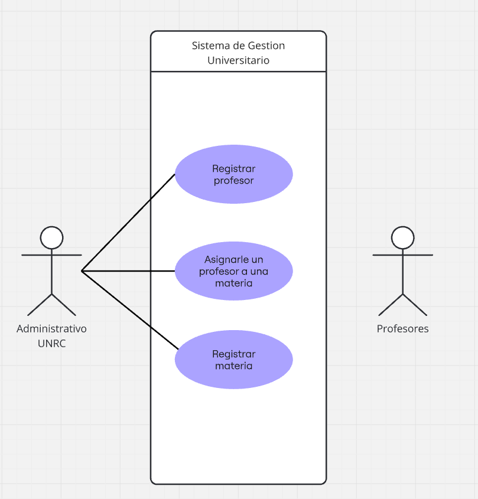

# **Software Requeriment Specification**

# **Proyecto Integrador IS : Sistema de Gestion Universitario**

# **Contenido**

---
## **1 Introducción**
Este documento es una Especificación de Requerimientos de Software para nuestro Sistema de Gestión de Universitario, donde se nos permite gestionar y visualizar a los profesores y a las materias dictadas por una institucion universitaria. Esta especificación esta estructurado basandose en el marco de la Practica Recomendada para Especificaciones de Requisitos de Software,  estándar IEEE 830 - 1998

### **1.1 Proposito**
Este documento tiene como propósito definir las especificaciones funcionales, no funcionales para el desarrollo de un sistema de gestion universitaria  que permitirá gestionar distintos procesos administrativos. El cual será utilizado por el personal administrativo de la institución.

### **1.2 Alcance** 
### **1.3 Equipo de Trabajo**
#### **1.3.1 Tamaño Del Equipo**
El tamaño ideal para este Sistema de Gestión Estudiantil es de 4 a 6 integrantes.

### **1.4 Definiciones, acronimos y abreviaturas** 

### **1.5 Referencias**
|     Titulo del documento   | Referencia |
|:---------------------------|:-----------|
|Standard IEEE 830-1998      |    IEEE    |

### **1.6 Resumen**
Este documento consta de tres secciones. 
En la primera sección se realiza una introducción al mismo y se proporciona una visión general de la especificación de recursos del sistema.
En la segunda sección del documento se realiza una descripción general del sistema, con
el fin de conocer las principales funciones que éste debe realizar, los datos asociados y los
factores, restricciones, supuestos y dependencias que afectan al desarrollo, sin entrar en
excesivos detalles.
Por último, la tercera sección del documento es aquella en la que se definen detalladamente los requisitos que debe satisfacer el sistema.

---

## **2.Descripción General**

### **2.1 Perspectiva del producto**

### **2.2 Funcionalidad del producto**
##### **El Sistema cuenta con las siguientes funcionalidades:**
- Gestion de profesores (Añadir profesores y asignarlos a materias)
- Gestion de materias (Sumar nuevas materias con sus respectivos datos)

### **2.3 Caracteristicas de los usuarios** 
#### 2.3.1 **Usuarios del sistema**
 - Personal de la Oficina de Alumnos: Actúan como los administradores del sistema. Su función principal es centralizar la información, llevar el registro de estudiantes y profesores, y gestionar la oferta académica y correlatividades.
 - Estudiantes: Utilizan el sistema para consultar su información académica. Esto incluye ver qué materias están cursando, cuáles pueden cursar según su avance y revisar sus notas finales de aprobación.
 - Profesores: Acceden al sistema para cargar notas y consultar los listados de sus alumnos. También se los registra para saber qué materias están dictando y su cargo (responsable de cátedra, JTP o ayudante)

### **2.4 Resticciones**
**Las recticciones tecnicas del sistema son:**
- Las tecnologías utilizadas son: JAVA, Mustache, SQLite, Spark y Maven Apache.
- La interfaz sera a traves de un sistema web, que correra en cualquier navegador.
- El sistema puede correr en sistema operativo.
- El sistema es dependiente de una conexión a internet.
- El sistema se modelara en un modelo cliente/servidor.
- La manipulacion del sistema sera unicamente por parte de los usuarios.
- La implentacion de este sistema debe contar con un patron de diseño identificable y sencillo.
- Debe contar con una conexion eficiente a un base de datos ligera.

### **2.5 Suposiciones y dependencias**

## **3.Requerimientos Especificos** 

### **3.1 Requisitos comunes de las interfaces**

#### 3.1.1 Interfaces de usuario
#### 3.1.2 Interfaces de hardware 
#### 3.1.3 Interfaces del software
#### 3.1.4 Interfaces de comunicación

### **3.2 Requerimientos funcionales**

### **3.3 Requerimientos no funcionales**  

#### 3.3.1 Requisitos de rendimiento 
#### 3.3.2 Seguridad 
#### 3.3.3 Fiabilidad
#### 3.3.4 Disponibilidad
#### 3.3.5 Mantenibilidad
#### 3.3.6 Portabilidad

---

